# 🧠 ClusterSense AI – Customer Segmentation System


A machine learning unsupervised learning system that segments customers into meaningful groups — helping businesses understand customer behavior, personalize offerings, and improve retention strategies.

🚀 **Live Demo:** [Launch Streamlit App](https://customer-segmentation-system-jqygzujxuwr3xuez7vsvic.streamlit.app/)

---

## Problem Statement

ClusterSense AI, a growing retail analytics company, wants to improve its marketing strategies by identifying hidden customer segments from transaction and behavioral data. Currently, the business applies the same campaigns to all customers, leading to low conversion rates and inefficient customer targeting.

To solve this, an unsupervised machine learning clustering system was built using customer demographic and purchasing behavior data. The objective is to discover meaningful customer groups using **K-Means**, **Agglomerative Clustering**, and **DBSCAN** — evaluated using the **Elbow Method** and **Silhouette Score** to identify optimal clusters and improve segmentation quality.

---

## Business Impact

| Goal | Approach |
|------|----------|
| Understand customer diversity | Unsupervised clustering on behavioral data |
| Identify high-value segments | Cluster profiling with mean feature analysis |
| Improve marketing targeting | Segment-level insights and visualizations |
| Enable personalization | Predict segment for any new customer |
| Production-ready deployment | Streamlit + Docker |

---

## Tech Stack

| Category | Tools |
|----------|-------|
| Language | Python |
| Data Processing | Pandas, NumPy |
| ML Models | KMeans, Agglomerative Clustering, DBSCAN |
| Preprocessing | StandardScaler, Winsorization |
| App Framework | Streamlit |
| Containerization | Docker |
| Model Serialization | Pickle |
| Version Control | Git & GitHub |

---

## ML Pipeline

```
Data Loading → Missing Value Handling → Winsorization
→ Encoding → Scaling → Elbow Method → Silhouette Analysis
→ KMeans Training (Best K) → Cluster Profiling
→ Streamlit Deployment → Docker Containerization
```

---

## Model Experimentation

Three clustering algorithms were evaluated to find the best segmentation approach:

| Model | Silhouette Score | Notes |
|-------|-----------------|-------|
| **KMeans** | ✅ Best | Consistent, scalable, interpretable |
| Agglomerative Clustering | Moderate | Hierarchical approach |
| DBSCAN | Lower | Struggled with dataset density |

**Best Strategy:** Winsorized Data + Standard Scaling + KMeans

**K Selection:**
- Elbow Method used to identify optimal WCSS drop
- Silhouette Scores computed for K=2 to K=10
- **K=3** selected as the optimal number of clusters

---

## Model Highlights

- **KMeans** selected as final model (best Silhouette Score)
- **Elbow Method** used for initial K estimation
- **Silhouette Score** used as primary evaluation metric
- **Winsorization** applied to handle outliers before scaling
- **StandardScaler** applied for feature normalization
- **Cluster Profiling** — mean feature values per segment
- Elbow and Silhouette data saved for Streamlit visualization
- Clustered customer data exported as CSV

---

## Project Structure

```
ClusterSense_AI/
│
├── artifacts/
│   ├── best_model.pkl                              # Trained KMeans model
│   ├── scaler.pkl                                  # Fitted StandardScaler
│   ├── model_columns.pkl                           # Encoded feature columns
│   ├── best_k.pkl                                  # Optimal K value
│   ├── clustered_customers.csv                     # Customers with cluster labels
│   ├── cluster_profiles.csv                        # Mean values per cluster
│   ├── elbow_data.csv                              # WCSS values for elbow plot
│   ├── silhouette_data.csv                         # Silhouette scores per K
│   └── clustersense_customer_segmentation_dataset.csv
│
├── images/                                         # Screenshots and visuals
├── logs/
│   └── clustersense.log                            # Pipeline logs
│
├── app.py                                          # Streamlit application
├── pipeline.py                                     # Final KMeans pipeline
├── experimentation.py                              # Multi-model experimentation
├── Dockerfile
├── requirements.txt
├── README.md
└── .gitignore
```

---

## Getting Started

### 1. Install Requirements

```bash
pip install -r requirements.txt
```

### 2. Run Training Pipeline

```bash
python pipeline.py
```

This generates:
- Trained KMeans model (`best_model.pkl`)
- Fitted scaler (`scaler.pkl`)
- Encoded feature columns (`model_columns.pkl`)
- Clustered customer data (`clustered_customers.csv`)
- Cluster profiles (`cluster_profiles.csv`)

### 3. Launch Streamlit App

```bash
streamlit run app.py
```

---

## Docker Support

### Build Image

```bash
docker build -t clustersense-app .
```

### Run Container

```bash
docker run clustersense-app
```

---

## Application Screenshots

### Homepage
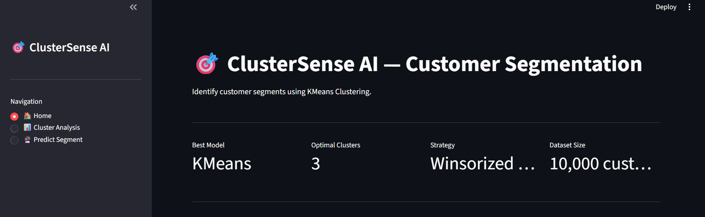

### Homepage Plots
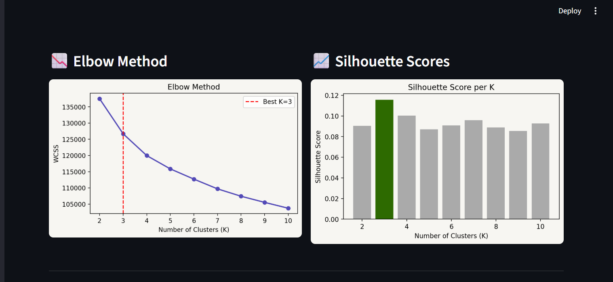

### Homepage Info
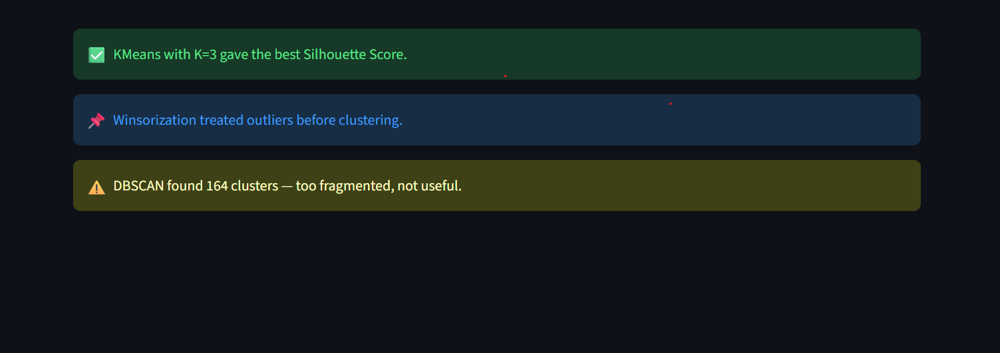

### Cluster Analysis
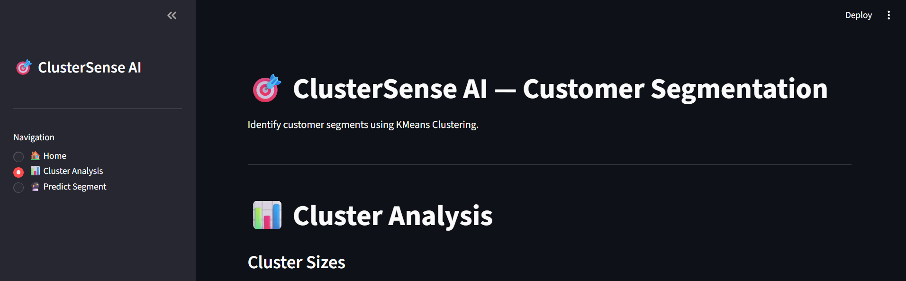

### Cluster Sizes Plot
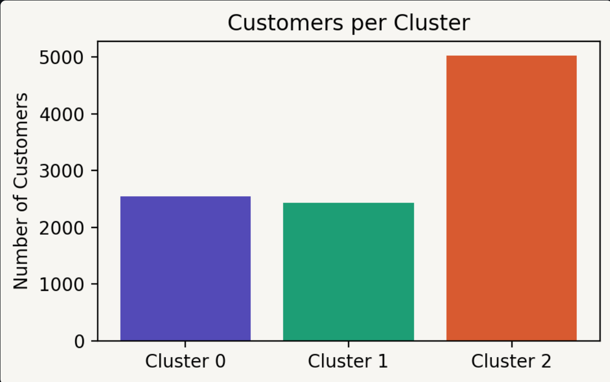

### Mean Values per Cluster
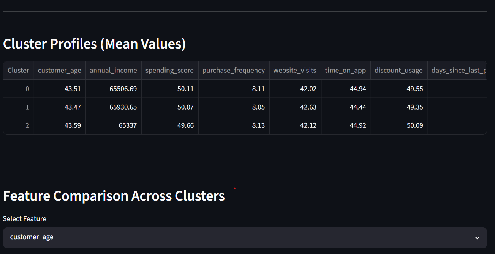

### Feature Comparison
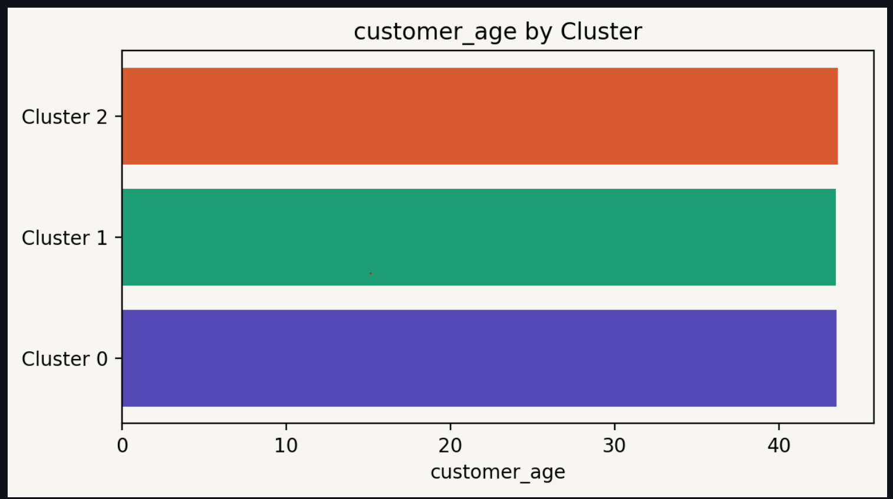

### Clustered Data
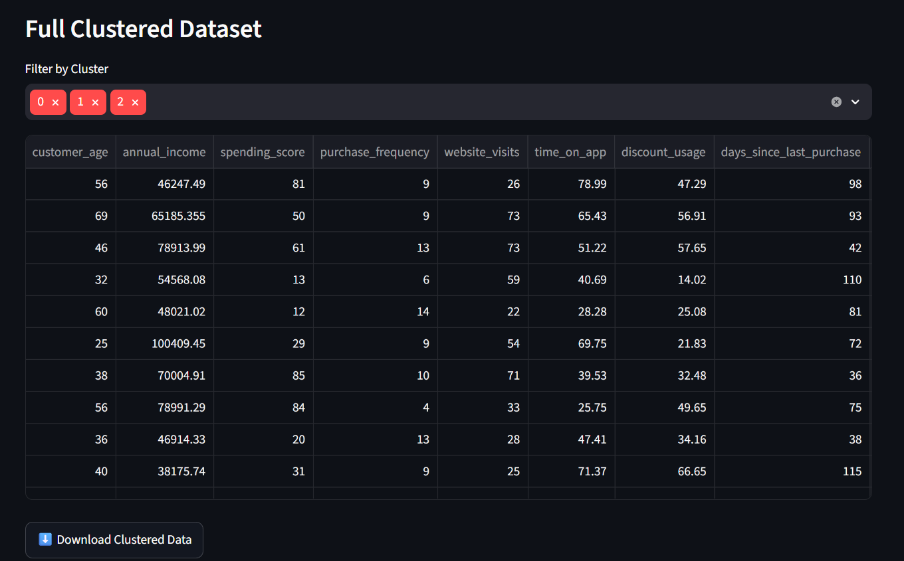

### Predict Segment


### Docker Deployment
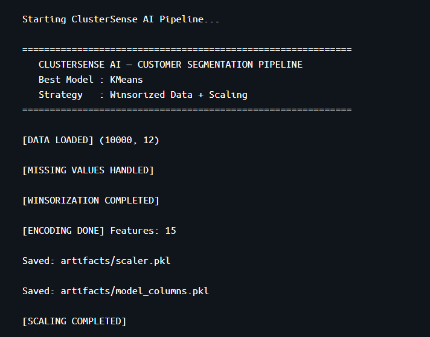
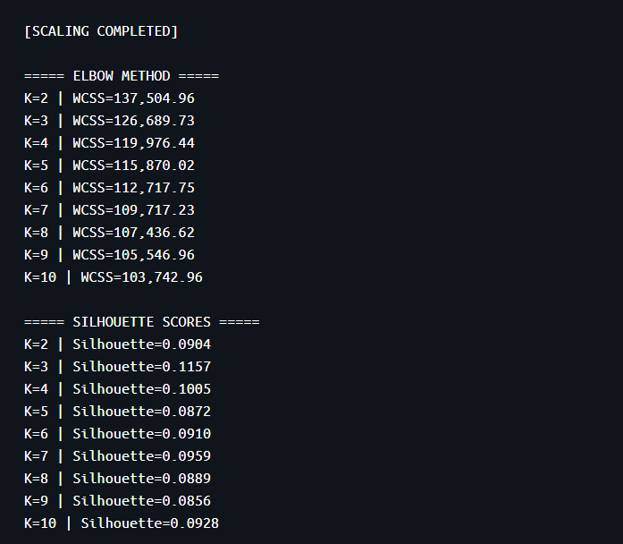
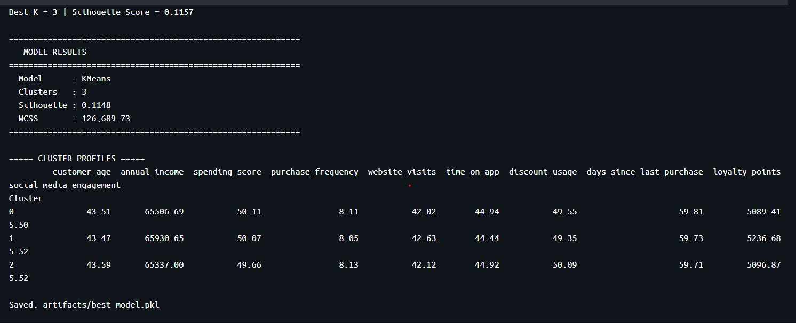
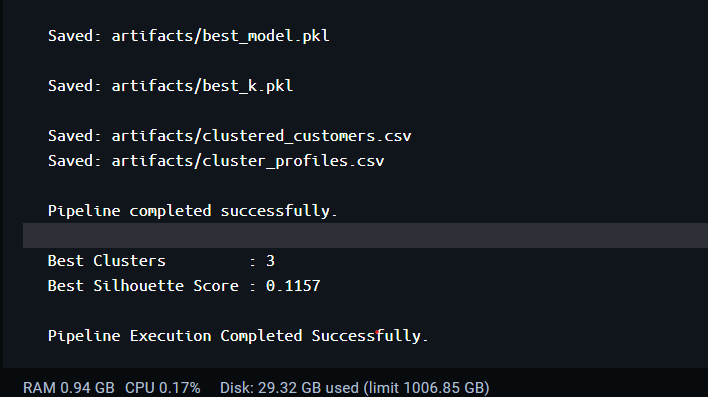

---

## Future Improvements

- [ ] Hyperparameter tuning for DBSCAN
- [ ] PCA-based dimensionality reduction
- [ ] CI/CD pipeline integration
- [ ] Cloud deployment (AWS/Azure)
- [ ] Automated cluster naming using LLMs

---

## Author

**Raj Kiran Reddy**
B.Tech Data Science | MLR Institute of Technology and Management
📍 Hyderabad, Telangana, India

[](https://github.com/)
[](https://linkedin.com/)